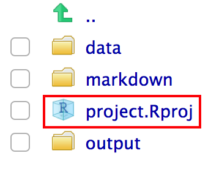

class: inverse center middle

```{r setup, include=FALSE}
options(htmltools.dir.version = FALSE)
knitr::opts_chunk$set(
  fig.width = 9, fig.height = 3.5, fig.retina = 3,
  out.width = "100%",
  cache = FALSE,
  echo = TRUE,
  message = FALSE, 
  warning = FALSE,
  hiline = TRUE
)
```

```{r xaringan-themer, include=FALSE, warning=FALSE}
library(xaringanthemer)
library(emo)

style_duo_accent(
  primary_color = "#1381B0",
  secondary_color = "#FF961C",
  inverse_header_color = "#FFFFFF",
  header_font_google = google_font("Noto Sans JP"),
  text_font_google   = google_font("Mplus 1p"),
  code_font_google   = google_font("Droid Mono"),
  text_font_size = "1.2rem"
)
```

```{r xaringanExtra-scribble, echo=FALSE}
xaringanExtra::use_scribble()
xaringanExtra::use_extra_styles(
  hover_code_line = TRUE,        
  mute_unhighlighted_code = TRUE 
)
```

<style>
.big {
  font-size: 1.5rem;
}
</style>

# Q: 何のためのベストプラクティス？

---
class: center middle

# A: 解析を再現するための<br>ベストプラクティス

---
## 再現性とは

.big[
> 将来の自分を始め、誰でも**簡単に**同じ解析を行なって、<br>**同じ結果が得られる**ようにすること
]

---
## 何を目指す？

.big[「再現できる」]

---
## 何を目指す？

.big[`r ji("x")`「再現できる」]

--

.big[`r ji("heavy large circle")`「なるべく再現しやすいようにする」]


---
## 解析の要素

.big[
- データ

- コード

- 解析環境
]

---
## 再現性の要素

- データ
  - 全てのデータを公開する
  - データを説明する(ドキュメンテーション)
- コード
  - コードを公開する
  - バージョン管理を使う
  - 誰でも（将来の自分を含めて）理解できる
  - コードが自動的に動く
  - コードと結果が直接に結びついている
- 解析環境
  - 全てのソフトウエアのバージョンを記述
  - 誰でも（将来の自分を含めて）再現できる（コンテナを使う）

---
## 再現性の要素

- データ
  - 全てのデータを公開する
  - データを説明する(ドキュメンテーション)
- **コード**
  - コードを公開する
  - バージョン管理を使う
  - 誰でも（将来の自分を含めて）理解できる
  - **コードが自動的に動く**
  - **コードと結果が直接に結びついている**
- **解析環境**
  - 全てのソフトウエアのバージョンを記述
  - **誰でも（将来の自分を含めて）再現できる（コンテナを使う）**
]

<!--  -->
]
---
class: center middle

# ネタバレ

---
## 最終的にこのようなことを目指す

- 一プロジェクト（一論文）が一つの**リポジトリー\***になっている
- リポジトリーがオンラインに公開している
- 誰でもダウンロードして、簡単に解析を再現することができる

.big[例：https://github.com/joelnitta/moorea_filmies]

.footnote[**\*リポジトリー** = バージョン管理のついたフォルダー]

---
class: center middle

# コードが自動的に動く
  
---
## Rプロジェクトを使いましょう！

`r ji("x")` `setwd("joels_computer/projects/kato_daphnia")`←自分のパソコンにしか<br>存在しないパス

`r ji("heavy large circle")` `kato_daphnia.Rproj`をクリック

.center[]

---
## Rプロジェクトを使いましょう！

1. "File" メニューボタンをクリックし、"New Project"をクリック
2. "New Directory"をクリック
3. "Empty Project"をクリック
4. プロジェクトを保存するディレクトリの名前を入力
5. "Create Project" ボタンをクリック

---
## `here`パケージについて

Rプロジェクトと相対パスを使えば、絶対パスを指定する必要は基本的にありません。

が、**どうしても絶対パスが必要になった時\***は`here()`を使いましょう：

```{r here-example}
here::here()
```

```{r here-example-2}
here::here("nested/folder/file")
```

.footnote[**\*ドッカーをマウントする時、Rmarkdownに使うファイルのパスを指定する時**]

---
## `targets`パケージについて

イメージ：Rの`makefile`

###「バイオインフォ」12.3（p448）

- 元々はソフトウエアをコンパイルするために生まれた

- 自動的に依存関係を認識し、目的のファイルを作る

---
## `targets`パケージについて

### プロジェクト構造

.big[
```
├── _targets.R
├── R/
  └──── functions.R
├── data/
  └──── raw_data.csv
```
]

---
## `targets`パケージについて

.pull-left[
### `_targets.R`
```{r example-targets-file, eval = FALSE}
library(targets)
library(tarchetypes)
library(tidyverse)
library(biglm)
source("R/functions.R")
list(
  tar_target(
    raw_data,
    read_csv("data/raw_data.csv")
  ),
  tar_target(
    data,
    filter(raw_data, !is.na(Ozone))
  ),
  tar_target(hist, create_plot(data)),
  tar_render(report, "index.Rmd")
)
```
]

.pull-right[
### `functions.R`
```{r example-targets-functions, eval = FALSE}
create_plot <- function(data) {
  ggplot(data) +
    geom_histogram(aes(x = Ozone), bins = 12) +
    theme_gray(24)
}
```
]

---
## `targets`パケージについて

.big[例：https://github.com/wlandau/targets-minimal]

---
## `targets`パケージの特徴

- データの読み込みから論文まで、**全てのステップを自動的に行う**
- 何かが変わった時、**必要なステップのみを実行する**
- 簡単に**パラレル化**できる
- Rコマンドにも、R以外のコマンドにも使える

---
## Rから他のソフトを走らせる方法

<!-- see https://github.com/yihui/knitr/issues/1203 -->

### 一番簡単：`system()`
```{r test, echo = TRUE, eval = FALSE}
system("ls")
```

```{r test_eval, echo = FALSE, eval = TRUE}
cat(system("ls", intern = TRUE), sep = "\n")
```

---
## Rから他のソフトを走らせる方法

### 上級：`processx::run()`
```{r processx}
library(processx)
run(
  command = "ls", 
  args = c("-a", "-h"), 
  wd = "data")
```

---
class: center middle

# 解析環境
  
---
## `renv`パケージについて

イメージ：pythonのconda、virtualenvみたいなパケージ管理システム


