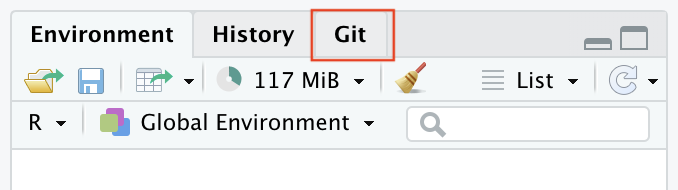

class: title-slide

```{r setup, include=FALSE}
options(htmltools.dir.version = FALSE)
knitr::opts_chunk$set(
  fig.width = 9, fig.height = 3.5, fig.retina = 3,
  out.width = "100%",
  cache = FALSE,
  echo = TRUE,
  message = FALSE, 
  warning = FALSE,
  hiline = TRUE
)
library(xaringanthemer)
library(emo)
library(flipbookr)
library(tidyverse)
```

```{r xaringan-themer, include=FALSE, warning=FALSE}
style_duo_accent(
  title_slide_text_color = "white",
  primary_color = "#1381B0",
  secondary_color = "#FF961C",
  inverse_header_color = "#FFFFFF",
  header_font_google = google_font("Noto Sans JP"),
  text_font_google   = google_font("Mplus 1p"),
  code_font_google   = google_font("Droid Mono"),
  text_font_size = "1.2rem",
  text_slide_number_font_size = "1.1rem",
  extra_css = list(
    ".title-slide h1" = list("font-family" = "Mplus 1p"),
    ".title-slide a, .title-slide a > code" = list("color" = "#FFFFFF")
  )
)
```

```{r xaringanExtra-scribble, echo=FALSE}
xaringanExtra::use_scribble()
xaringanExtra::use_extra_styles(
  hover_code_line = TRUE,        
  mute_unhighlighted_code = TRUE 
)
```

# R上級編

## 私のベストプラクティス

### ニッタ ジョエル

「バイオインフォマティクスデータスキル」輪読会 21.07.12

.footnote[slides: https://joelnitta.github.io/bioinfo_skills_2021-07-12<br>source: https://github.com/joelnitta/bioinfo_skills_2021-07-12]

---
## その前に：鈴木さんのdplyrのお悩み相談

`dplyr`を初め、Rにとって**縦長データの方が扱いやすい**ことが多い

今の形：幅広い

```{r read-suzuki-data, message = FALSE, warning = FALSE, rows.print=6}
trait_data <- read_csv("data/repData0001_5traits_motility_taxonomy_condensed_traits_GTDB.csv")

print(trait_data, n = 6)
```

---
`r chunk_reveal("suzuki-data-transform", break_type = "user", title = "## 縦長にすると扱いやすくなります")`

```{r set-width, include = FALSE}
# Tweak tibble width when printing so it doesn't run off the page
tbl_width_orig <- getOption("tibble.width")
options(tibble.width = 65)
```

```{r suzuki-data-transform, include = FALSE}
trait_data %>%  #BREAK
  select(cell_shape:sporulation) %>%  #BREAK
  pivot_longer(
    names_to = "trait", 
    values_to = "value", 
    everything()) %>% #BREAK
  group_by(trait) %>%
  summarize(
    n_states = n_distinct(value)
  )
```

---
`r chunk_reveal("suzuki-data-transform-2", break_type = "user", title = "## 縦長にすると扱いやすくなります")`

```{r suzuki-data-transform-2, include = FALSE}
trait_data %>%
  select(cell_shape:sporulation) %>%
  pivot_longer(
    names_to = "trait", 
    values_to = "value", 
    everything()) %>% #BREAK
  group_by(trait) %>%
  count(value) %>%
  print(n = Inf)
```

```{r return-width, include = FALSE}
# Return tibble width to default
tbl_width_orig <- getOption("tibble.width")
options(tibble.width = tbl_width_orig)
```

---
class: inverse center middle

<style>
.big {
  font-size: 1.5rem;
}
</style>

# Q: 何のためのベストプラクティス？

---
class: center middle

# A: 解析を再現するための<br>ベストプラクティス

---
## 再現性とは

.big[
> 将来の自分を始め、誰でも**簡単に**同じ解析を行なって、<br>**同じ結果が得られる**ようにすること
]

---
## 何を目指す？

.big[「再現できる」]

---
## 何を目指す？

.big[`r ji("x")`「再現できる」]

--

.big[`r ji("heavy large circle")`**「なるべく再現しやすいようにする」**]


---
## 解析の要素

.big[
- データ

- コード

- 解析環境
]

---
## 再現性の要素

- データ
  - 全てのデータを公開する
  - データを説明する(ドキュメンテーション)
- コード
  - コードを公開する
  - バージョン管理を使う
  - 誰でも（将来の自分を含めて）理解できる
  - コードが自動的に動く
  - コードと結果が直接に結びついている
- 解析環境
  - 全てのソフトウエアのバージョンを記述
  - 誰でも（将来の自分を含めて）再現できる（コンテナを使う）


<div style="position:absolute; left:83%; top:22%">再現しづらい</div>
<div style="position:absolute; left:85%; top:80%">再現しやすい</div>

---
## 再現性の要素

- データ
  - 全てのデータを公開する
  - データを説明する(ドキュメンテーション)
- **コード**
  - コードを公開する
  - バージョン管理を使う
  - 誰でも（将来の自分を含めて）理解できる
  - **コードが自動的に動く**
  - **コードと結果が直接に結びついている**
- **解析環境**
  - 全てのソフトウエアのバージョンを記述
  - **誰でも（将来の自分を含めて）再現できる（コンテナを使う）**


<div style="position:absolute; left:83%; top:22%">再現しづらい</div>
<div style="position:absolute; left:85%; top:80%">再現しやすい</div>

---
class: center middle

# ネタバレ

---
## 最終的にこのようなことを目指す

- 一プロジェクト（一論文）が一つの**リポジトリー\***になっている
- リポジトリーがオンラインに公開している
- 誰でもダウンロードして、簡単に解析を再現することができる

.big[例：https://github.com/joelnitta/moorea_filmies]

.footnote[**\*リポジトリー** = バージョン管理のついたフォルダー]

---
class: center middle

# コードが自動的に動く
  
---
## Rプロジェクトを使いましょう！

`r ji("x")` `setwd("joels_computer/analysis/project")`←自分のパソコンにしか<br>存在しないパス

`r ji("heavy large circle")` `project.Rproj`をクリック

.center[]

---
## その前に: デフォルト設定を変えましょう

.pull-left[
Tools → Global Options...
- 必ず**きれいな状態**でRが立ち上がるようにする
- そうしないと、前のセッションから<br>オブジェクトが環境に残ってしまう
- コマンドライン：
```
R --no-save --no-restore-data
```
]


---
## Rプロジェクトを使いましょう！

1. "File" メニューボタンをクリックし、"New Project"をクリック
2. "New Directory"をクリック
3. "Empty Project"をクリック
4. プロジェクトを保存するディレクトリの名前を入力
5. "Create Project" ボタンをクリック**（"Use Git"の選択）**

---
## RStudioでgitを使う

参考：**Happy Git and GitHub for the useR**　https://happygitwithr.com/

.pull-left[
**Rプロジェクトでないと使えない**

- "Create Project" ボタンをクリック<br>**（"Use Git"の選択）**

- "Environment", "History"の隣に"Git"が<br>現れる

- 問題が起こったら：https://happygitwithr.com/rstudio-see-git.html
]

.pull-right[

]
---
## `here`パケージについて

**Rプロジェクト**と**相対パス**を使えば、絶対パスを指定する必要は基本的にありません。

が、**どうしても絶対パスが必要になった時\***は`here()`を使いましょう：

```{r here-example}
here::here()
```

```{r here-example-2}
here::here("nested", "file")
```

.footnote[**\*ドッカーをマウントする時、Rmarkdownに使うファイルのパスを指定する時**]

---
## `targets`パケージについて

https://github.com/ropensci/targets


イメージ：Rの`makefile`

###「バイオインフォ」12.3（p448）

- `makefile` =「元々はソフトウエアをコンパイルするために生まれた」

- **自動的に依存関係を認識**し、目的のファイルを作る

---
## `targets`パケージについて


### プロジェクト構造

.big[
```
├── _targets.R
├── R/
  └──── functions.R
├── data/
  └──── raw_data.csv
```
]

---
## `targets`パケージについて

.pull-left[
### `_targets.R`
```{r example-targets-file, eval = FALSE}
library(targets)
library(tarchetypes)
library(tidyverse)
library(biglm)
source("R/functions.R")
list(
  tar_target(
    raw_data,
    read_csv("data/raw_data.csv")
  ),
  tar_target(
    data,
    filter(raw_data, !is.na(Ozone))
  ),
  tar_target(hist, create_plot(data)),
  tar_render(report, "index.Rmd")
)
```
]

.pull-right[
### `functions.R`
```{r example-targets-functions, eval = FALSE}
create_plot <- function(data) {
  ggplot(data) +
    geom_histogram(aes(x = Ozone), bins = 12) +
    theme_gray(24)
}
```
]

---
## `targets`パケージについて

.big[例：https://github.com/wlandau/targets-minimal]

---
## `targets`パケージの特徴

- データの読み込みから論文まで、**全てのステップを自動的に行う**
- 何かが変わった時、**必要なステップのみを実行する**
- 簡単に**パラレル化**できる
- Rコマンドにも、R以外のコマンドにも使える

---
## Rから他のソフトを走らせる方法

<!-- see https://github.com/yihui/knitr/issues/1203 -->

### 一番簡単：`system()`
```{r test, echo = TRUE, eval = FALSE}
system("ls")
```

```{r test_eval, echo = FALSE, eval = TRUE}
cat(system("ls", intern = TRUE), sep = "\n")
```

---
## Rから他のソフトを走らせる方法

### 上級：`processx::run()`
```{r processx}
library(processx)
run(
  command = "ls", 
  args = c("-a", "-h"), 
  wd = "data")
```

---
class: center middle

# 解析環境
  
---
## `renv`パケージについて

https://rstudio.github.io/renv/

イメージ：pythonのconda、virtualenvみたいなパケージ管理システム

---
## `renv`パケージについて

Rのデフォルト設定では、全てのパッケージは**同じ（プロジェクト意外の）場所**に保管される<br>（「ライブラリー」と呼ばれる）

```{r show-here}
# hereでプロジェクトの場所を確認しよう
here::here()
```

```{r default-lib-show, eval = FALSE}
# renvを使っていない状態
.libPaths()
```

```{r default-lib-hide, echo = FALSE}
default_lib_loc <- "/Library/Frameworks/R.framework/Versions/4.1/Resources/library"
```

```{r print-default-lib, echo = FALSE}
default_lib_loc
```

---
## `renv`パケージについて

Rのデフォルト設定では、全てのパッケージは**同じ（プロジェクト意外の）場所**に保管される<br>（「ライブラリー」と呼ばれる）

.center[

]

.footnote[https://kevinushey-2020-rstudio-conf.netlify.app/slides.html#47]

---
## `renv`パケージについて

`renv`を使うと、各プロジェクトが**そのプロジェクトだけのライブラリー**を持つ

```{r renv-lib-show}
# hereでプロジェクトの場所を確認しよう
here::here()
# renvを使っている状態
.libPaths()
```

---
## `renv`パケージについて

`renv`を使うと、各プロジェクトが**そのプロジェクトだけのライブラリー**を持つ
<br><br>
.center[

]

.footnote[https://kevinushey-2020-rstudio-conf.netlify.app/slides.html#56]

---
## `renv`の重要なコマンド：

`renv::init()`: プロジェクトのライブラリーを作る

`renv::snapshot()`：ライブラリーの現状を`renv.lock`ファイルに記録する

`renv::restore()`：`renv.lock`からライブラリーを復元する

---
## `renv.lock`ファイルの中身

.pull-left[
- パッケージ名
- バージョン
- 由来
- ハッシュ

### 大事：`renv.lock`をgitで保存(コミット)する

]

.pull-right[
```
　　"Rcpp": {
      "Package": "Rcpp",
      "Version": "1.0.7",
      "Source": "Repository",
      "Repository": "CRAN",
      "Hash": "dab19adae4440ae55aa8a9d238b246bb"
    },
    "assertthat": {
      "Package": "assertthat",
      "Version": "0.2.1",
      "Source": "Repository",
      "Repository": "CRAN",
      "Hash": "50c838a310445e954bc13f26f26a6ecf"
    },
...
```
]

---
## dockerの使い方

### パターンその１

一つのプロジェクト：一つのイメージ

シチュエーション：主にRで完結する場合。`rocker`イメージで全部のパケージ（とRStudio）をインストール

### パターンその２

一つの解析ツール：一つのイメージ

シチュエーション：他のソフトをたくさん使う場合。**特にバイオインフォのパイプライン。**

---
## パターンその１

`Dockerfile` (例：https://github.com/joelnitta/moorea_filmies/blob/main/Dockerfile)

```
FROM rocker/verse:4.0.3

RUN apt-get update \
  && apt-get install -y --no-install-recommends \
  libpoppler-cpp-dev

# Modify Rprofile.site so renv uses /renv for project library
RUN mkdir renv \
  && echo 'Sys.setenv(RENV_PATHS_LIBRARY = "/renv")' >> /usr/local/lib/R/etc/Rprofile.site \
  && mkdir tmp/project

# Initialize a 'dummy' project and restore the renv library
COPY ./renv.lock tmp/project
WORKDIR tmp/project
RUN Rscript -e 'install.packages("renv"); renv::consent(provided = TRUE); renv::settings$use.cache(FALSE); renv::init(bare = TRUE); renv::restore()'

WORKDIR /home/rstudio/
```

---
## パターンその１

### 使い方

```
docker run --rm -v ${PWD}:/tmpdir -w /tmpdir user_name/image_name Rscript -e 'targets::tar_make()' 
```

---
## パターンその２

（もうすぐこのやり方についてhttps://joelnitta.com にてブログポストを書く予定）

例：https://github.com/IwasakiLab/kato_daphnia

.pull-left[
- `conda`でRをインストール

- `renv`でパケージ管理

- Rから`docker`を呼び出す
]

.pull-right[
`environment.yaml`
```
name: daphnia-env
channels:
  - conda-forge
  - bioconda
  - defaults
dependencies:
  - r-renv=0.12.*
  - pandoc=2.11.4
```
]

---
## パターンその２

### 使い方

セットアップ
```
# conda環境を復元
conda env create -f environment.yml
# 環境に入る
conda activate daphnia-env
# Rパケージを復元
Rscript -e 'renv::restore()'
```

実行
```
Rscript -e 'targets::tar_make()'
```

---
## 参考文献

[What They Forgot to Teach You About R](https://rstats.wtf/)

[Happy Git with R](https://happygitwithr.com/)

[Targets Manual](https://books.ropensci.org/targets/)

[renv @ RStudioConf 2020](https://kevinushey-2020-rstudio-conf.netlify.app/)
